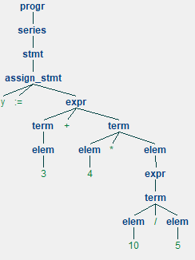
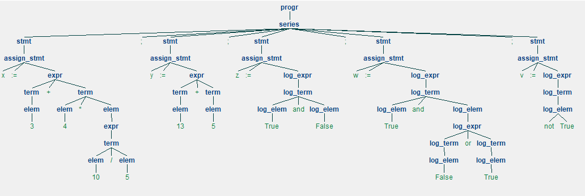
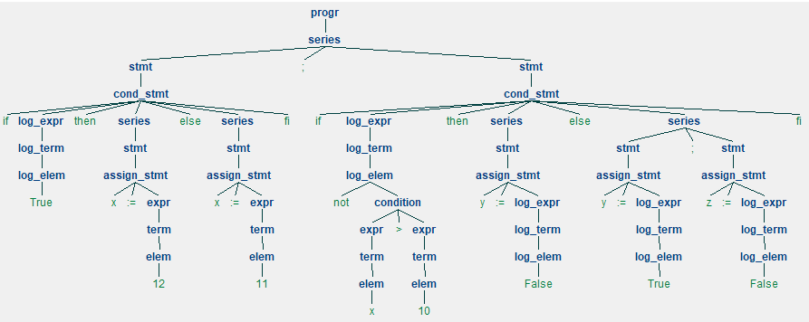

*********

**Darba autore:** Anitra Adriāna Beināre

**Studentu apliecības Nr.:** ab19155

**Izstrādāts:** 03/2022

**Izstrādes vide:** JetBrains PyCharm Professional

*********

Projektā iekļautais kods ļauj lietotājam padot programmai teksta datni, 
no kura tiks veidots sintakes koks, atbilstoši **_Pam_v2_** gramatikai.
Programmas darbības laikā tiek izveidota koka struktūra sistēmas atmiņā un tā tiek pārveidota tā, 
lai to varētu attēlot lietotājam vizuālā formātā.  

*********

# Lietotāja instrukcija iebūvētajai gramatikai Pam_v2

Nepieciešams nodrošināt ANTLR spraudni un šādas _Python_ pakotnes:
* pip
* nltk
* antlr4-python3-runtime

Lai uzsāktu programmu, komandrindā ar "cd" komandu jānavigē līdz šī projekta 
datņu mapei (automātiska darbība, ja izmanto _PyCharm_ iebūvēto termināli) un jāievada komanda `python main.py tests.txt`, 
kur "tests.txt" ir projekta datņu mapē ievietotās ievades datnes nosaukums (obligāti jāiekļauj ".txt"). 

Rezultātā programmas atmiņā tiks izveidots abstraktās sintakes koks, 
kurš tiks izvadīts kā zīmējums izlecošā logā. 

Ja padotajā datnē ir kļūdas (ievades dati neatbilst **_Pam_v2_** gramatikai), 
tiek izvadīts paziņojums konsolē, kurā uzsāk programmu.

*********

## Uzstādīšanas nosacījumi jaunai gramatikai

Jaunas gramatikas uzstādīšanas soļi:
1) ievieto datni ar gramatikas definējumu (datnes tips - _.g4_) projekta datņu mapē;
2) izstrādes vidē ar labo peles klikšķi izvēlas gramatikas definējuma datni, izvēlas "_Configure ANTLR..._:
   1) ieraksta "**_Python3_**" valoda laukā "_Language_";
   2) Opcionāli - ievada nosaukumu datņu mapei, kurā izvadīs programmas darbībai nepieciešamos parsera failus, ievadot nosaukumu
   ievadlaukā "_Output directory where all output is generated_";
3) ar labo peles klikšķi izvēlas gramatikas definējuma datni, izvēlas "_Generate ANTLR Recognizer_";
4) pārbauda, ka tikko ģenerētā datņu mape satur datnes ar nosaukumiem "_LanguageLexer.py_" un "_LanguageParser.py_", 
   kur _Language_ ir gramatikas nosaukums;
5) `main.py` datnē:
   1) pārmaina 4. un 5. rindu kodu, izmantojot jaunās gramatikas datnes;
   2) pārmaina 14. rindas kodu, ievietojot "progr" vietā uzsākšanas komandu no gramatikas definējuma datnes.

Piemēri izvadītiem koka izvedumiem:

*********

# ANTLR 4 REFERENCE

Interpretators izteiksmēm: sākot no 132.lpp (**7.4 Labeling Rule Alternatives for Precise Event Methods**)
Reāli jālasa no 134.lpp (7.5), kur ir runa par visitors, bet 7.4 palīdz labāk saprast.  

https://dl.icdst.org/pdfs/files3/a91ace57a8c4c8cdd9f1663e1051bf93.pdf