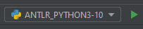
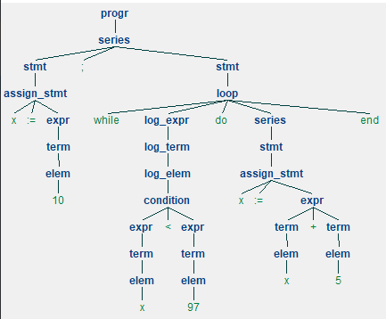

*********

**Darba autore:** Anitra Adriāna Beināre

**Studentu apliecības Nr.:** ab19155

**Izstrādāts:** 03/2022

**Izstrādes vide:** JetBrains PyCharm Professional

*********

Projektā iekļautais kods ļauj lietotājam padot programmai teksta datni, 
no kura tiks veidots sintakes koks, atbilstoši **_Pam_v2_** gramatikai.
Programmas darbības laikā tiek izveidota koka struktūra sistēmas atmiņā un tā tiek pārveidota tā, 
lai to varētu attēlot lietotājam vizuālā formātā.  


*********

# Lietotāja instrukcija iebūvētajai gramatikai Pam_v2

Nepieciešams nodrošināt ANTLR spraudni un šādas _Python_ pakotnes:
* pip
* nltk
* antlr4-python3-runtime, versija **4.9.2** (**ne jaunāka!**)

## Darbs komandrindā

Lai uzsāktu programmu komandrindā, ar "cd" komandu jānavigē līdz šī projekta 
datņu mapei (automātiska darbība, ja izmanto _PyCharm_ iebūvēto termināli) un 
jāievada komanda `python main.py input.txt data.txt`, 
kur abas datnes ir ievietotas projekta datņu mapē (obligāti jāiekļauj ".txt"). 

## Darbs _PyCharm_ IDE

Jānodrošina, ka ir pareizi konfigurēts _Python_ interpretators un jānospiež augšējā labajā stūrī esošā programmas palaišanas poga:



## Rezultāts

Rezultātā programmas atmiņā tiks izveidots abstraktās sintakes koks, 
kurš tiks izvadīts kā zīmējums izlecošā logā, 
un komandrindā tiks izvadīts programmas rezultāts, ja programma satur ```write``` komandu.

Ja padotajā datnē ievades dati neatbilst **_Pam_v2_** gramatikai, 
tiek izvadīts paziņojums konsolē, kurā uzsāk programmu. 

*********

## Uzstādīšanas nosacījumi jaunai gramatikai

Jaunas gramatikas uzstādīšanas soļi:
1) ievieto datni ar gramatikas definējumu (datnes tips - _.g4_) projekta datņu mapē;
2) izstrādes vidē ar labo peles klikšķi izvēlas gramatikas definējuma datni, izvēlas "_Configure ANTLR..._:
   1) ieraksta "**_Python3_**" valoda laukā "_Language_";
   2) Opcionāli - ievada nosaukumu datņu mapei, kurā izvadīs programmas darbībai nepieciešamos parsera failus, ievadot nosaukumu
   ievadlaukā "_Output directory where all output is generated_";
3) ar labo peles klikšķi izvēlas gramatikas definējuma datni, izvēlas "_Generate ANTLR Recognizer_";
4) pārbauda, ka tikko ģenerētā datņu mape satur datnes ar nosaukumiem "_LanguageLexer.py_" un "_LanguageParser.py_", 
   kur _Language_ ir gramatikas nosaukums;
5) `main.py` datnē:
   1) pārmaina 4. un 5. rindu kodu, izmantojot jaunās gramatikas datnes;
   2) pārmaina 14. rindas kodu, ievietojot "progr" vietā uzsākšanas komandu no gramatikas definējuma datnes.

Piemērs izvadītiem koka izvedumiem:


*********

# ANTLR 4 REFERENCE

Interpretators izteiksmēm: sākot no 132.lpp (**7.4 Labeling Rule Alternatives for Precise Event Methods**)
No 134.lpp (7.5), ir runa par visitors, bet 7.4 palīdz labāk saprast.  

https://dl.icdst.org/pdfs/files3/a91ace57a8c4c8cdd9f1663e1051bf93.pdf